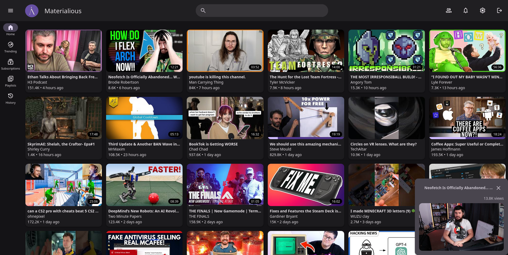

  
  <quote>
  Modern material design for Invidious.
  </quote>

&nbsp;

-------

[Help translate Materialious!](https://fink.inlang.com/github.com/WardPearce/Materialious)

# Features
- [Syncios integration!](https://github.com/WardPearce/syncious)
  - Sync your watch progress between Invidious sessions.
- Watch sync parties!
- Mini player.
- Preview video on hover.
- Sponsorblock built-in.
- Return YouTube dislikes built-in.
- DeArrow built-in (With local processing fallback).
- Video progress tracking & resuming.
- No ads.
- No tracking.
- Light/Dark themes.
- Custom colour themes.
- Integrates with Invidious subscriptions, watch history & more.
- Live stream support.
- Dash support.
- Chapters.
- Audio only mode.
- Playlists.
- PWA support.
- YT path redirects (So your redirect plugins should still work!)

# Public instances
[Public instances are listed here](./docs/INSTANCES.md).

Open an issue to add your instance.

# Docker deployment
Deploy Materialious for your Invidious instance using Docker. Follow the steps outlined [here](./docs/DOCKER.md) for easy setup.

# Desktop (Windows/MacOS/Linux)
The latest release can be downloaded [here](https://github.com/Materialious/Materialious/releases/latest).

# Android
Due to Google's policies on custom YouTube frontends, Materialious isn't available on Google play. The best way to install is via the [release page](https://github.com/Materialious/Materialious/releases/latest). It is recommended to use [Obtainium](https://github.com/ImranR98/Obtainium), to keep Materialious up to date.

# Previews

## Mobile

## Player

## Settings

## Mini player

## Channel

## Chapters

## Playlists

# Have any questions?
[Join our Matrix space](https://matrix.to/#/#ward:matrix.org)

# Special thanks to
- [Invidious](https://github.com/iv-org)
- [Clipious](https://github.com/lamarios/clipious) for inspiration & a good source for learning more about undocumented Invidious routes.
- [Vidstack player](https://github.com/vidstack/player)
- [Beer CSS](https://github.com/beercss/beercss) (Especially the [YouTube template](https://github.com/beercss/beercss/tree/main/src/youtube) what was used as the base for Materialious.)
- Every dependency in [package.json](/materialious/package.json).
