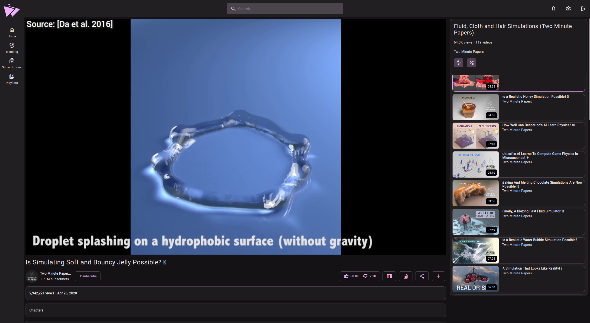

  
   
   
  <h1>Materialious</h1>
  <quote>
    Modern material design for Invidious.
  </quote>

&nbsp;

-------

# Features
- [Invidious companion support.](./docs/DOCKER.md#invidious-companion-support)
- [Invidious API extended integration.](https://github.com/Materialious/api-extended)
- [YouTube.js](https://github.com/LuanRT/YouTube.js) fallback if Invidious fails loading videos for Desktop & Android.
- Support for disabling certificate validation for homelab users.
- Sync your watch progress between Invidious sessions.
- Watch sync parties.
- Sponsorblock built-in.
- Return YouTube dislikes built-in.
- DeArrow built-in (With local processing fallback).
- No ads.
- No tracking.
- Light/Dark themes.
- Custom colour themes.
- Integrates with Invidious subscriptions, watch history & more.
- Live stream support.
- Dash support.
- Chapters.
- Audio only mode.
- Playlists.
- PWA support.
- YT path redirects (So your redirect plugins should still work!)

# Support table
|         | Dash | HLS | Local video fallback | API-Extended | Dearrow | RYD | Watch Parties |
|---------|------|-----|----------------------|--------------|---------|-----|----------------|
| Web     | ✅    | ✅   | ❌                    | ✅            | ✅       | ✅   | ✅              |
| Desktop | ✅    | ✅   | ✅                    | ✅            | ✅       | ✅   | ❌              |
| Android | ✅    | ✅   | ✅                    | ✅            | ✅       | ✅   | ❌              |

# Deploying as a website via docker
[Please read the guide here](./docs/DOCKER.md)

# Installing as a app
<!--This layout is taken from spotube's README as I really liked its layout.
I've commented out places what aren't relevant but might be in the future.-->
<table>
  <tr>
    <th>Platform</th>
    <th>Package/Installation Method</th>
  </tr>
  <tr>
    <td>Windows</td>
    <td>
      
  </tr>
  <tr>
    <td>MacOS (x64 & arm64)</td>
    <td>
      
    </td>
  </tr>
  <tr>
    <td>Android</td>
    <td>
       
      
       
       
        
       
       
        
       
       
      
       
    </td>
  </tr>
  <tr>
  <!-- <tr>
    <td>iOS</td>
    <td>
      
       
      <blockquote style="color:red">
        *iPA file only. Requires sideloading with <a href="https://altstore.io/">AltStore</a> or similar tools.
      </blockquote>
    </td>
  </tr> -->
  <tr>
    <td>Flatpak</td>
    <td>
      
<code>flatpak install flathub us.materialio.Materialious</code>

      
    </td>
  </tr>
  <tr>
    <td>AppImage</td>
    <td>
      
    </td>
  </tr>
  <tr>
    <td>Debian/Ubuntu</td>
    <td>
      
      
Then run: <code>sudo apt install ./Materialious-linux-amd64.deb</code>

    </td>
  </tr>
  <!-- <tr>
    <td>Arch/Manjaro</td>
    <td>
      
With pamac: <code>sudo pamac install spotube-bin</code>

      
With yay: <code>yay -Sy spotube-bin</code>

    </td>
  </tr> -->
  <tr>
    <td>Fedora/OpenSuse</td>
    <td>
      
      
For Fedora: <code>sudo dnf install ./Materialious-linux-x86_64.rpm</code>

      
For OpenSuse: <code>sudo zypper in ./Materialious-linux-x86_64.rpm</code>

    </td>
  </tr>
  <tr>
    <td>Linux (tarball)</td>
    <td>
      
    </td>
  </tr>
  <!-- <tr>
    <td>Macos - <a href="https://brew.sh">Homebrew</a></td>
    <td>
<pre lang="bash">
brew tap krtirtho/apps
brew install --cask spotube
</pre>
    </td>
  </tr>
  <tr>
    <td>Windows - <a href="https://chocolatey.org">Chocolatey</a></td>
    <td>
      
<code>choco install spotube</code>

    </td>
  </tr>
  <tr>
    <td>Windows - <a href="https://scoop.sh">Scoop</a></td>
    <td>
      
<code>scoop bucket add extras</code>

      
<code>scoop install spotube</code>

    </td>
  </tr>
  <tr>
    <td>Windows - <a href="https://github.com/microsoft/winget-cli">WinGet</a></td>
    <td>
      
<code>winget install --id KRTirtho.Spotube</code>

    </td>
  </tr> -->
</table>

# Translations

Help [translate Materialious via Weblate](https://toolate.othing.xyz/projects/materialious/)!

# Previews

## Mobile

## Player

## Transcript

## Settings

## Channel

## Chapters

## Playlists

# Have any questions?
[Join our Matrix space](https://matrix.to/#/#ward:matrix.org)

# Special thanks to
- [SecularSteve](https://github.com/SecularSteve) for creating Materialious' logo.
- [Invidious](https://github.com/iv-org)
- [Clipious](https://github.com/lamarios/clipious) for inspiration & a good source for learning more about undocumented Invidious routes.
- [Beer CSS](https://github.com/beercss/beercss) (Especially the [YouTube template](https://github.com/beercss/beercss/tree/main/src/youtube) what was used as the base for Materialious.)
- Every dependency in [package.json](/materialious/package.json).
- [LuanRT](https://github.com/LuanRT) for YouTube.js & SABR implementation.
- [FreeTube](https://github.com/FreeTubeApp/FreeTube) for their subtitle fix.
- [spotube](https://github.com/KRTirtho/spotube) for using their README layout for local installation.

# Developers
- [How Materialious is built](./docs/BUILDING.md)
- [How to contribute to Materialious](./docs/DEV.md)
