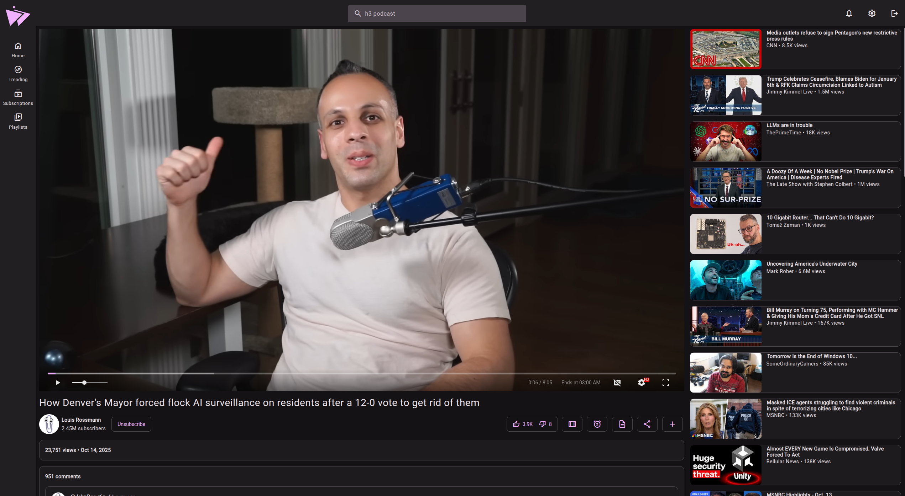

> [!WARNING]  
> Invidious is currently being blocked by Google. Please use Materialious on [Android](https://github.com/Materialious/Materialious/releases/latest) or [Desktop](https://github.com/Materialious/Materialious/releases/latest) to get around this with local video fallback.

  
   
   
  <h1>Materialious</h1>
  <quote>
    Modern material design for Invidious.
  </quote>

&nbsp;

-------

[Help translate Materialious!](https://fink.inlang.com/github.com/WardPearce/Materialious)

# Features
- [Invidious API extended integration!](https://github.com/Materialious/api-extended)
  - Sync your watch progress between Invidious sessions.
- Watch sync parties!
- Silence skipper (Experimental.)
- [YouTube.js](https://github.com/LuanRT/YouTube.js) fallback if Invidious fails loading videos for Desktop & Android.
- Preview video on hover.
- Sponsorblock built-in.
- Return YouTube dislikes built-in.
- DeArrow built-in (With local processing fallback).
- Video progress tracking & resuming.
- No ads.
- No tracking.
- Light/Dark themes.
- Custom colour themes.
- Integrates with Invidious subscriptions, watch history & more.
- Live stream support.
- Dash support.
- Chapters.
- Audio only mode.
- Playlists.
- PWA support.
- YT path redirects (So your redirect plugins should still work!)

# Support table
|         | Dash | HLS | Local video fallback | API-Extended | Dearrow | RYD |
|---------|------|-----|----------------------|--------------|---------|-----|
| Web     | ✅    | ✅   | ❌                    | ✅            | ✅       | ✅   |
| Desktop | ✅    | ✅   | ✅                    | ✅            | ✅       | ✅   |
| Android | ✅    | ✅   | ✅                    | ✅            | ✅       | ✅   |

# Public instances
[Public instances are listed here](./docs/INSTANCES.md).

Open an issue to add your instance.

# Docker deployment
Deploy Materialious for your Invidious instance using Docker. Follow the steps outlined [here](./docs/DOCKER.md) for easy setup.

# Desktop (Windows/MacOS/Linux)

  
  
  

# Android

  
  
  
  

# Previews

## Mobile

## Player

## Transcript

## Settings

## Channel

## Chapters

## Playlists

# Have any questions?
[Join our Matrix space](https://matrix.to/#/#ward:matrix.org)

# Special thanks to
- [SecularSteve](https://github.com/SecularSteve) for creating Materialious' logo.
- [Invidious](https://github.com/iv-org)
- [Clipious](https://github.com/lamarios/clipious) for inspiration & a good source for learning more about undocumented Invidious routes.
- [Vidstack player](https://github.com/vidstack/player)
- [Beer CSS](https://github.com/beercss/beercss) (Especially the [YouTube template](https://github.com/beercss/beercss/tree/main/src/youtube) what was used as the base for Materialious.)
- Every dependency in [package.json](/materialious/package.json).

# Developers
- [How Materialious is built](./docs/BUILDING.md)
- [How to contribute to Materialious](./docs/DEV.md)