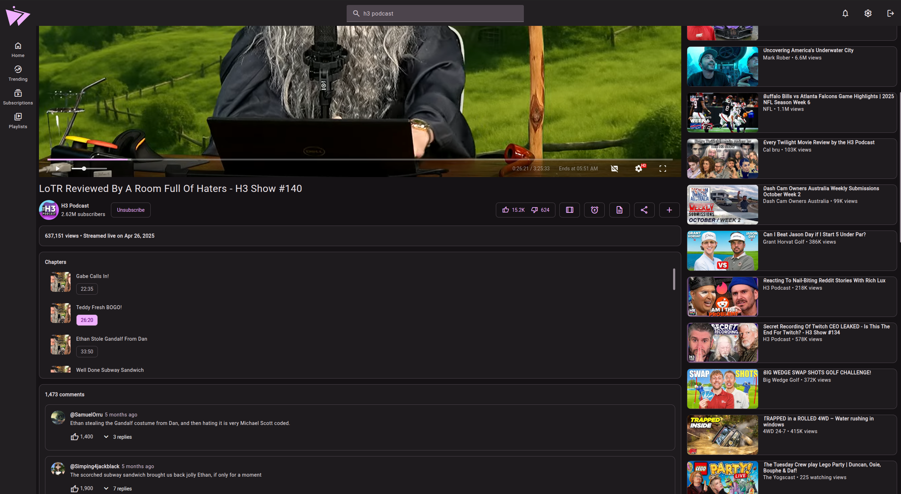

  
  <quote>
  Modern material design for Invidious.
  </quote>

&nbsp;

-------

## Features
- Sponsorblock built-in.
- Return YouTube dislikes built-in.
- Video progress tracking & resuming.
- No ads.
- No tracking.
- Light/Dark themes.
- Custom colour themes.
- Integrates with Invidious subscriptions, watch history & more.
- Live stream support.
- Dash support.
- Chapters.
- Audio only mode.

## Todo
- Playlist support.
- Localization.

## Previews

# Special thanks to
- [Invidious](https://github.com/iv-org)
- [Beer CSS](https://github.com/beercss/beercss) (Especially the [YouTube template](https://github.com/beercss/beercss/tree/main/src/youtube) what was used as the base for Materialious.)
- Every dependency in [package.json](/materialious/package.json).